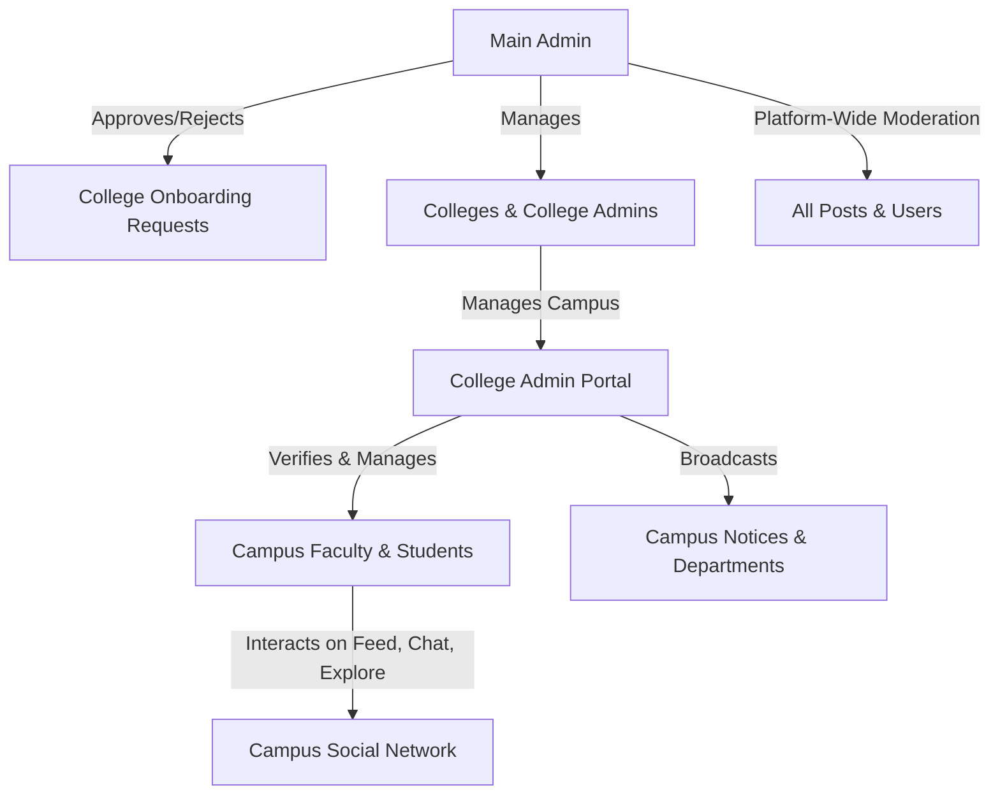

# Swish — Campus Social Network (v1.0)
### QA & Testing Documentation · Product Functionality Guide · Test Cases


**Swish** is an exclusive, verified campus social network and administration platform connecting students, faculty, college administrators, and platform operators in a trusted environment.

---

## 📑 Table of Contents

1. [System Architecture & Roles](#-system-architecture--roles)
2. [Tech Stack & Security Model](#-tech-stack--security-model)
3. [End-to-End User Functionalities](#-end-to-end-user-functionalities)
   - [3.1 Main Admin](#31-main-admin)
   - [3.2 College Admin](#32-college-admin)
   - [3.3 Student](#33-student)
   - [3.4 Faculty](#34-faculty)
4. [User Journeys & Workflow Lifecycles](#-user-journeys--workflow-lifecycles)
5. [Comprehensive QA Test Cases (Swish v1)](#-comprehensive-qa-test-cases-swish-v1)
   - [Suite 1: Authentication & Dual Auth](#suite-1-authentication--dual-auth-tc-auth)
   - [Suite 2: College Onboarding & Review](#suite-2-college-onboarding--review-tc-onb)
   - [Suite 3: College Admin First Login & Management](#suite-3-college-admin-first-login--management-tc-cadmin)
   - [Suite 4: Student & Faculty Registration](#suite-4-student--faculty-registration-tc-reg)
   - [Suite 5: Posts, Media, Likes & Comments](#suite-5-posts-media-likes--comments-tc-post)
   - [Suite 6: Explore, Search & Social Graph](#suite-6-explore-search--social-graph-tc-expl)
   - [Suite 7: Real-Time Messaging & Presence](#suite-7-real-time-messaging--presence-tc-msg)
   - [Suite 8: Main Admin Platform Moderation](#suite-8-main-admin-platform-moderation-tc-admin)
   - [Suite 9: Security, Route Guards & Edge Cases](#suite-9-security-route-guards--edge-cases-tc-sec)
6. [Local Setup & Testing Credentials](#-local-setup--testing-credentials)

---

## 🏛 System Architecture & Roles

Swish enforces strict **Role-Based Access Control (RBAC)** across 4 user tiers:



### Role Matrix

| Role | Access Scope | Allowed Routes | Prohibited Routes |
|---|---|---|---|
| **Main Admin** (`admin` / `main_admin`) | Global platform administration, college approvals, cross-campus user & post moderation | `/admin`, `/admin/pending-requests`, `/admin/pending-requests/:id` | Student feed (`/home`), messages (`/messages`), explore (`/explore`) |
| **College Admin** (`college_admin`) | Single-college administration, student/faculty management, notices, departments | `/college-admin`, `/college-admin/*`, `/first-login`, `/change-password` | Main admin portal (`/admin`), student feed (`/home`) |
| **Faculty** (`faculty`) | Student feed, direct messages, academic management dashboard | `/home`, `/explore`, `/profile/:id`, `/messages`, `/settings`, `/faculty/*` | `/admin`, `/college-admin` |
| **Student** (`student`) | Campus social feed, posts, comments, likes, follow graph, direct messages | `/home`, `/explore`, `/profile/:id`, `/messages`, `/notifications`, `/settings` | `/admin`, `/college-admin`, `/faculty` |

---

## 🔒 Tech Stack & Security Model

- **Frontend**: React 19, Vite, Tailwind CSS v4, Framer Motion, Lucide Icons, Socket.io Client.
- **Backend**: Node.js, Express.js, MongoDB (Mongoose), Socket.io Server, Nodemailer, Cloudinary.
- **Dual Authentication**:
  1. **HTTP-Only Cookies (`swish_token`)**: Secure, `SameSite=Lax/None` for browser session security.
  2. **Authorization Bearer Header (`Bearer <token>`)**: Stored in `localStorage` upon login, dispatched with every `fetch` request and Socket.io handshake (`auth: { token }`). This guarantees 100% auth reliability across cross-origin ports and in browsers with third-party cookie blocking.
- **Institution Gating**: Non-admin users can only log in if their college domain exists and is set to `active: true`.

---

## 📱 End-to-End User Functionalities

### 3.1 Main Admin
- **Platform Analytics**: Live KPI counters for Total Colleges, Active Colleges, Total Students, Total Faculty, Total College Admins, Pending Requests, Active Users, and Escalated Reports.
- **College Onboarding Moderation**:
  - View list of pending college verification requests with search and status filtering.
  - Review submitted official email, college name, domain, contact phone, and proof document (viewable in new tab via signed Cloudinary URL).
  - **Approve**: Auto-creates the College and College Admin in MongoDB, generates a secure temporary password, and emails credentials to the official contact.
  - **Reject**: Rejects with mandatory reason and sends notification email.
- **Colleges Management**:
  - View all registered colleges with domain, location, admin count, and active status.
  - One-click active/inactive toggle (deactivating a college locks access for all students/faculty under that domain).
- **College Admins Management**:
  - View all college administrators, their associated college, and account status.
  - Manual provisioning of college administrators with official email and designation.
  - One-click activate / deactivate toggle.
- **User Directory Management**:
  - Search and filter users by role (`student`, `faculty`), college, or status (`active`, `suspended`).
  - One-click account suspension / reactivation.
- **Cross-Campus Post Moderation**:
  - View all posts across colleges with author info, images, captions, tags, and timestamps.
  - Direct deletion of any policy-violating post (automatically decrements the author's post count).

### 3.2 College Admin
- **First Login Security**: If `mustChangePassword` is true, the user is forced into `/first-login` to set a custom password before accessing the dashboard.
- **Campus Dashboard**: Campus-specific metrics (enrolled students, verified faculty, published notices, departments).
- **Student Management**: View campus student roster, verify student status, view enrollment IDs.
- **Faculty Management**: View campus faculty members, departments, and designations.
- **Department Management**: Add and manage campus academic departments.
- **Campus Notice Board**: Create, publish, and delete official college notices.
- **College Profile**: View and edit official campus details, logo, and descriptions.

### 3.3 Student
- **Join & OTP Verification**:
  - Registration gated to active college domains (e.g. `@campus.edu`).
  - 6-digit email OTP verification with resend cooldown timer.
- **Campus Feed**:
  - View posts from fellow students and campus members.
  - Stories strip with interactive full-screen story viewer.
  - Right-panel trending topics and suggested students to follow.
- **Post Creation**:
  - Upload photos (JPEG, PNG, WEBP, GIF up to 5MB) via Cloudinary/multer.
  - Add captions (up to 2,200 characters) and hashtags.
- **Engagement**:
  - Like/unlike posts with real-time optimistic counter updates.
  - Comment drawer with threaded comments and live count updates.
- **Explore & Search**:
  - Discover posts, trending hashtags, and campus users.
  - Follow / unfollow other users with instant follower/following count synchronization.
- **Direct Messaging (Socket.io)**:
  - Real-time 1-on-1 private messaging.
  - Active conversation list with unread indicators.
  - Real-time online presence status (green indicator).
- **Profile & Settings**:
  - View personal posts grid, followers, and following lists.
  - Edit profile name, bio, and upload profile avatar.
  - Appearance settings (Dark / Light mode toggle).

### 3.4 Faculty
- All core student social capabilities (Feed, Posts, Comments, Likes, Messages, Profile).
- Access to **Faculty Academic Portal** (`/faculty`):
  - Student directory by department and year.
  - Academic reports and escalation queue.
  - Campus moderation feed.

---

## 🔄 User Journeys & Workflow Lifecycles

### Journey 1: College Onboarding to Live Campus
1. An institution representative visits `/college-onboarding`.
2. Submits college name, domain (`.edu`), address, official email, and uploads authorization document.
3. System verifies official email via 6-digit OTP.
4. Request appears in Main Admin `/admin/pending-requests`.
5. Main Admin clicks request -> reviews proof doc -> clicks **Approve**.
6. System provisions the College, generates College Admin credentials, and sends email.
7. College Admin logs in -> redirected to `/first-login` -> sets new password -> lands on `/college-admin`.
8. Students can now register at `/join` using `@<college-domain>`.

### Journey 2: Student Registration to Feed Interaction
1. Student enters name, username, campus email, and password at `/join`.
2. System checks domain against active colleges in MongoDB.
3. System dispatches 6-digit OTP to student's email.
4. Student enters OTP at `/join` (OTP step) -> account verified.
5. Student logs in at `/login` -> redirected to `/home`.
6. Student creates a post with an image and caption -> post appears in feed.
7. Another student likes and comments -> counts increment in real time.

---

## 🧪 Comprehensive QA Test Cases (Swish v1)

### Suite 1: Authentication & Dual Auth (`TC-AUTH`)

| Test ID | Test Case | Steps to Execute | Expected Result | Pass/Fail |
|---|---|---|---|---|
| **TC-AUTH-01** | Main Admin Login | 1. Go to `/login`<br>2. Enter `admin@swish.com` and `SwishAdmin@2026`<br>3. Click Sign In | Redirects to `/admin`. Bearer token saved in `localStorage`. 200 OK on `/api/admin/dashboard`. | |
| **TC-AUTH-02** | Invalid Credentials | 1. Go to `/login`<br>2. Enter valid email with wrong password<br>3. Submit | Red error alert appears: `"Invalid email or password."`. No redirect. | |
| **TC-AUTH-03** | Dual Auth Header Verification | 1. Log in as Main Admin<br>2. Inspect network tab on any subsequent request | Outgoing request contains `Authorization: Bearer <jwt_token>` AND `Cookie: swish_token=...`. | |
| **TC-AUTH-04** | Role-Based Redirect (Student) | 1. Log in with student credentials | Redirects automatically to `/home`. | |
| **TC-AUTH-05** | Role-Based Redirect (College Admin) | 1. Log in with college admin credentials | Redirects to `/college-admin` (or `/first-login` if password not changed). | |
| **TC-AUTH-06** | Role-Based Redirect (Faculty) | 1. Log in with faculty credentials | Redirects to `/faculty` or `/home` based on setup. | |
| **TC-AUTH-07** | Logout Flow | 1. Click Logout in sidebar / navigation | Cookie is cleared, `swish_token` in `localStorage` is removed. Redirects to `/`. | |
| **TC-AUTH-08** | Inactive College Block | 1. Have Main Admin deactivate a college<br>2. Attempt login as student from that college | Returns 403 Forbidden with message: `"Your institution access is currently inactive."`. | |
| **TC-AUTH-09** | Deactivated Account Block | 1. Have Admin deactivate a specific user<br>2. Attempt login as that user | Returns 401 Unauthorized with message: `"This account has been deactivated."`. | |
| **TC-AUTH-10** | Session Persistence on Refresh | 1. Log in<br>2. Refresh page at `/admin` or `/home` | Session rehydrates from `/api/auth/me`. User remains logged in without flashing login screen. | |

---

### Suite 2: College Onboarding & Review (`TC-ONB`)

| Test ID | Test Case | Steps to Execute | Expected Result | Pass/Fail |
|---|---|---|---|---|
| **TC-ONB-01** | College Onboarding Submission | 1. Navigate to `/college-onboarding`<br>2. Fill in college details and upload PDF/image proof<br>3. Click Submit | Triggers OTP verification email to contact address. | |
| **TC-ONB-02** | Onboarding OTP Verification | 1. Enter 6-digit OTP received in email | Onboarding request marked as `PENDING`. Confirmation message displayed. | |
| **TC-ONB-03** | Pending Request Queue in Admin | 1. Log in as Main Admin<br>2. Navigate to `/admin/pending-requests` | Submitted request appears in the table with college name, email, and timestamp. | |
| **TC-ONB-04** | Proof Document Viewing | 1. Open request detail at `/admin/pending-requests/:id`<br>2. Click "View Document" | Document opens in a new tab via secure signed URL. | |
| **TC-ONB-05** | College Request Approval | 1. On request detail page, click "Approve"<br>2. Confirm modal | College is created in `colleges` collection. College Admin user created. Email with credentials sent. Status updates to `APPROVED`. | |
| **TC-ONB-06** | College Request Rejection | 1. On request detail page, click "Reject"<br>2. Enter rejection reason and submit | Status updates to `REJECTED`. Rejection email with reason sent to applicant. | |

---

### Suite 3: College Admin First Login & Management (`TC-CADMIN`)

| Test ID | Test Case | Steps to Execute | Expected Result | Pass/Fail |
|---|---|---|---|---|
| **TC-CADMIN-01** | First Login Force Password Change | 1. Log in with temporary credentials received via approval email | ProtectedRoute detects `mustChangePassword: true` and forces redirect to `/first-login`. | |
| **TC-CADMIN-02** | Password Update Execution | 1. Enter current password and new password (min 8 chars)<br>2. Submit | Password updated in MongoDB, `mustChangePassword` set to `false`. Redirects to `/college-admin`. | |
| **TC-CADMIN-03** | Notice Creation | 1. Navigate to `/college-admin/notices`<br>2. Click "Add Notice", enter title, content, target audience<br>3. Publish | Notice created and visible to campus students and faculty. | |
| **TC-CADMIN-04** | Department Management | 1. Navigate to `/college-admin/departments`<br>2. Add a new department (e.g. "Computer Science") | Department saved and selectable in student registration. | |

---

### Suite 4: Student & Faculty Registration (`TC-REG`)

| Test ID | Test Case | Steps to Execute | Expected Result | Pass/Fail |
|---|---|---|---|---|
| **TC-REG-01** | Registration with Active Campus Email | 1. Navigate to `/join`<br>2. Fill name, username, password, and active college email<br>3. Submit | Form progresses to OTP verification step. Email sent. | |
| **TC-REG-02** | Registration with Inactive/Unregistered Domain | 1. Enter email with unknown domain (e.g. `test@random.com`)<br>2. Submit | Error displayed: Domain not registered or institution inactive. | |
| **TC-REG-03** | OTP Verification & Account Activation | 1. Enter valid 6-digit OTP received via email | Account verified (`isEmailVerified: true`). User automatically redirected to `/home`. | |
| **TC-REG-04** | Resend OTP Cooldown | 1. Click "Resend Code" on OTP screen | 60-second cooldown timer starts. Resend disabled until timer expires. | |
| **TC-REG-05** | Duplicate Email/Username Block | 1. Attempt registering with already registered email or username | 400/409 validation error: `"Email or username already in use."`. | |

---

### Suite 5: Posts, Media, Likes & Comments (`TC-POST`)

| Test ID | Test Case | Steps to Execute | Expected Result | Pass/Fail |
|---|---|---|---|---|
| **TC-POST-01** | Create Post with Photo & Caption | 1. On `/home`, open Create Post modal<br>2. Select image (JPEG/PNG) and enter caption<br>3. Submit | Post uploads to Cloudinary, appears at the top of the feed with image and author badge. | |
| **TC-POST-02** | Large File Upload Block (>5MB) | 1. Select image file > 5MB | Error alert: `"Image must be 5MB or smaller."`. Upload rejected. | |
| **TC-POST-03** | Invalid File Format Block | 1. Attempt uploading `.pdf` or `.exe` as post photo | Error alert: `"Only JPEG, PNG, WEBP, or GIF images are allowed."`. | |
| **TC-POST-04** | Like Post (Optimistic & Server Sync) | 1. Click heart icon on a post | Heart turns red immediately, count increments by 1. Backend updates atomically. | |
| **TC-POST-05** | Unlike Post | 1. Click liked heart icon | Heart turns gray, count decrements by 1. | |
| **TC-POST-06** | Add Comment | 1. Click comment icon on a post<br>2. Type comment in drawer and submit | Comment appears in thread immediately. Post card comment counter increments. | |
| **TC-POST-07** | Delete Own Post | 1. Navigate to personal post on profile<br>2. Click delete and confirm | Post is removed from feed and profile. Post count on profile decrements by 1. | |
| **TC-POST-08** | Unauthorized Post Deletion | 1. Attempt deleting another user's post as a student | Delete option is not shown. API returns 403 if called directly. | |

---

### Suite 6: Explore, Search & Social Graph (`TC-EXPL`)

| Test ID | Test Case | Steps to Execute | Expected Result | Pass/Fail |
|---|---|---|---|---|
| **TC-EXPL-01** | Explore Grid Loading | 1. Navigate to `/explore` | Grid of campus posts loads cleanly with responsive columns. | |
| **TC-EXPL-02** | User Search | 1. Type student/faculty name in search bar | Matching user profiles appear with avatar, handle, and college name. | |
| **TC-EXPL-03** | Follow User | 1. Click "Follow" on a user card/profile | Button switches to "Following". Target user's follower count increases by 1. Current user's following count increases by 1. | |
| **TC-EXPL-04** | Unfollow User | 1. Click "Following" to unfollow | Button switches to "Follow". Respective counts decrement by 1. | |

---

### Suite 7: Real-Time Messaging & Presence (`TC-MSG`)

| Test ID | Test Case | Steps to Execute | Expected Result | Pass/Fail |
|---|---|---|---|---|
| **TC-MSG-01** | WebSocket Handshake with Dual Auth | 1. Open browser console -> Network tab -> WS<br>2. Log in and navigate to `/messages` | Connection to `ws://localhost:3001/socket.io/` succeeds with 101 Switching Protocols (no 400 error). | |
| **TC-MSG-02** | Send & Receive Direct Message | 1. Open two browser windows (User A & User B)<br>2. User A sends message to User B | Message bubble appears instantly in User B's conversation window without refresh. | |
| **TC-MSG-03** | Online Presence Indicator | 1. User A logs in<br>2. User B views User A in conversation list | Green dot / online status indicator displays next to User A. | |
| **TC-MSG-04** | Disconnect Presence Update | 1. User A closes browser / logs out | User B sees User A's status transition to offline. | |
| **TC-MSG-05** | Empty State Messaging | 1. Open messages with no conversations | Clean empty-state graphic: `"Select a conversation to start chatting"`. | |

---

### Suite 8: Main Admin Platform Moderation (`TC-ADMIN`)

| Test ID | Test Case | Steps to Execute | Expected Result | Pass/Fail |
|---|---|---|---|---|
| **TC-ADMIN-01** | Admin Dashboard KPI Accuracy | 1. Log in as Main Admin -> `/admin` | Stat cards display correct count for Colleges, Students, Faculty, Admins, Posts, and Pending Requests. | |
| **TC-ADMIN-02** | Colleges Tab Search & Filter | 1. Click "Colleges" in sidebar<br>2. Search by college name or filter by status | Table filters dynamically in real time. | |
| **TC-ADMIN-03** | College Status Toggle | 1. Click active/inactive switch on a college | Status toggles. Immediate confirmation. Students from that college are blocked on subsequent auth. | |
| **TC-ADMIN-04** | College Admin Provisioning | 1. Click "College Admins" tab<br>2. Click "Add College Admin"<br>3. Fill college, name, official email, designation | New College Admin is created and listed in table. | |
| **TC-ADMIN-05** | College Admin Status Toggle | 1. Click toggle on a College Admin account | Account is deactivated. Admin cannot log in. | |
| **TC-ADMIN-06** | All Users Directory Search | 1. Click "Users" tab<br>2. Filter by role (student/faculty) or status | User list updates. Search works across name, email, and handle. | |
| **TC-ADMIN-07** | Cross-Campus Post Deletion | 1. Click "All Posts" tab in sidebar<br>2. Search posts by keyword or author<br>3. Click "Delete Post" and confirm | Post is permanently deleted across the entire platform. Author's post count decrements. | |
| **TC-ADMIN-08** | Route Guard: Admin Blocked from Shell | 1. While logged in as Main Admin, manually enter `/home` or `/messages` in URL bar | Guard in `ProtectedRoute.jsx` intercepts and immediately redirects back to `/admin`. | |

---

### Suite 9: Security, Route Guards & Edge Cases (`TC-SEC`)

| Test ID | Test Case | Steps to Execute | Expected Result | Pass/Fail |
|---|---|---|---|---|
| **TC-SEC-01** | Unauthenticated Protected Route Access | 1. In a private window (logged out), navigate to `/home`, `/admin`, or `/settings` | Redirected immediately to `/login`. | |
| **TC-SEC-02** | Student Accessing Admin Route | 1. Log in as student<br>2. Manually enter `/admin` in address bar | Redirected to `/home`. Access denied. | |
| **TC-SEC-03** | Student Accessing College Admin Route | 1. Log in as student<br>2. Manually enter `/college-admin` | Redirected to `/home`. Access denied. | |
| **TC-SEC-04** | Direct API Access without Bearer/Cookie | 1. Send `GET http://localhost:3001/api/admin/dashboard` using Postman/curl without headers | Returns `401 Unauthorized`: `{"ok": false, "error": "Not authenticated. Please log in."}`. | |
| **TC-SEC-05** | Cross-Site Scripting (XSS) in Captions/Comments | 1. Create a post with `<script>alert(1)</script>` in caption or comment | Content is sanitized / rendered as plain text. No script execution occurs. | |
| **TC-SEC-06** | Rate Limiting on OTP Attempts | 1. Submit invalid OTP 5 times consecutively | Returns `429 Too Many Requests`: `"Too many incorrect attempts. Please request a new verification code."`. | |

---

## 🚀 Local Setup & Testing Credentials

### Prerequisites
- **Node.js**: v18 or later
- **npm**: v9 or later
- **MongoDB**: Active connection string configured in `backend/.env`

### 1. Start the Backend Server
```bash
cd backend
npm install
node src/index.js
```
- Server URL: `http://localhost:3001`
- Health Check: `http://localhost:3001/api/health`

### 2. Start the Frontend Development Server
```bash
# In the project root (Swish/)
npm install
npm run dev
```
- Application URL: `http://localhost:5173`

### 3. Default Testing Credentials

| Role | Email | Password | Target Dashboard |
|---|---|---|---|
| **Main Admin** | `admin@swish.com` | `SwishAdmin@2026` | `http://localhost:5173/admin` |

*(All other test accounts and fake colleges were purged so you can test clean onboarding and user registration from scratch!)*
