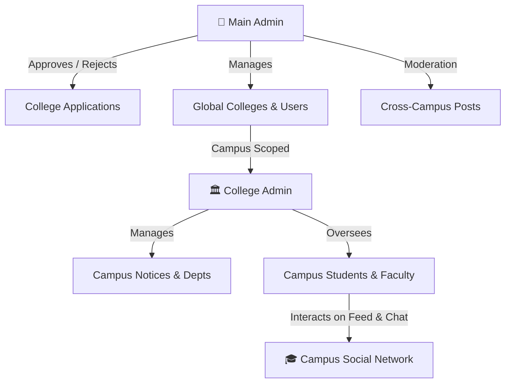

# 🎓 Swish — Campus Social Network & Community Hub

<div align="center">


**An exclusive, verified digital campus connecting students, faculty, and college administrators in one sleek, modern ecosystem.**

[](https://react.dev/)
[](https://vitejs.dev/)
[](https://tailwindcss.com/)
[](https://nodejs.org/)
[](https://www.mongodb.com/)
[](https://socket.io/)
[](LICENSE)

[Quickstart](#-quickstart-for-friends--devs) • [Demo Accounts](#-ready-to-use-demo-accounts) • [Features](#-features-at-a-glance) • [Tech Stack](#-tech-stack) • [QA & Testing](docs/QA_TEST_CASES.md)

</div>

---

## 🌟 What is Swish?

**Swish** brings back the authentic campus community vibe. Instead of noisy public social media, Swish provides a **trusted, domain-gated environment** where students, faculty, and college administrators interact safely.

Think of it as:
> **Instagram Feed + Slack Direct Chat + Campus Notice Board + Admin Governance Portal** — all in one modern, glassmorphic web application.

---

## ✨ Features at a Glance

### 🎓 Campus Verification & Onboarding
- **Domain-Gated Registration**: Only students and faculty with verified college email domains (e.g. `@campus.edu`) can join.
- **6-Digit Email OTP Verification**: Automated email verification with cooldown timers.
- **College Onboarding Portal**: New colleges can apply by submitting institutional details and official verification documents.

### 📸 Vibrant Social Feed
- **Media Posts**: Share updates with high-resolution image uploads (Multer + Cloudinary), captions, and hashtags.
- **Instant Likes & Threaded Comments**: Optimistic UI like updates with atomic MongoDB updates, and a slide-out drawer for comments.
- **Stories Bar**: Fullscreen interactive campus stories viewer with smooth progress bars.
- **Explore & Social Graph**: Discover peers across campus, search by name/handle, and follow/unfollow with real-time stat synchronization.

### 💬 Real-Time Direct Messaging
- **1-on-1 Chat**: Low-latency private messaging powered by **Socket.io**.
- **Live Presence Indicators**: Green dot showing who's currently online across campus.
- **Message Badges**: Clean unread message counters and responsive chat view.

### 🏛️ College Admin Portal
- **Campus Metrics**: Real-time counter of enrolled students, verified faculty, and published notices.
- **Notice Board**: Broadcast official announcements to students and faculty.
- **Roster & Department Management**: Manage campus branches and review student/faculty rosters.

### 👑 Super Admin Command Center
- **Platform Analytics**: Global KPIs for registered colleges, active users, and system health.
- **College Request Moderation**: Review onboarding applications, inspect uploaded proof documents, and approve/reject with automated credential generation.
- **Content Moderation**: Global directory search, user account deactivation, and cross-campus post deletion.

### 🌓 Premium Design & UX
- **Theme Modes**: Seamless Dark / Light mode toggle.
- **Micro-Animations**: Powered by Framer Motion and Lucide icons.
- **Dual Authentication**: Combines secure HTTP-only cookies with Authorization Bearer tokens for rock-solid reliability across all browsers and devices.

---

## ⚡ Quickstart for Friends & Devs

Get Swish running on your local machine in under **3 minutes**:

### 1. Prerequisites
Make sure you have installed:
- [Node.js](https://nodejs.org/) (v18 or higher recommended)
- [MongoDB](https://www.mongodb.com/try/download/community) running locally on `localhost:27017` (or a free [MongoDB Atlas](https://www.mongodb.com/cloud/atlas) cluster URI)
- [Git](https://git-scm.com/)

---

### 2. Clone the Repository
```bash
git clone https://github.com/sarveshpatil1ui/Swish.git
cd Swish
```

---

### 3. Backend Setup

Open a terminal and set up the backend server:

```bash
# 1. Navigate to backend directory
cd backend

# 2. Install dependencies
npm install

# 3. Create your local environment file
cp .env.example .env

# 4. Seed the database with demo users, posts & colleges
npm run seed

# 5. Start the backend server (runs on port 3001)
npm run dev
```

> **Backend is now live at:** `http://localhost:3001`  
> **Health Check:** `http://localhost:3001/api/health`

---

### 4. Frontend Setup

Open a **second terminal** in the project root (`Swish/`):

```bash
# 1. Install frontend dependencies
npm install

# 2. Create frontend environment file
cp .env.example .env

# 3. Start the Vite development server
npm run dev
```

> **Frontend is now live at:** `http://localhost:5173` 🎉  
> Open it in your browser and start exploring!

---

## 🔑 Ready-to-Use Demo Accounts

Running `npm run seed` instantly populates demo accounts across all 4 roles. **No email setup or OTP needed to test right away!**

| Role | Name | Email | Password | What You Can Explore |
|---|---|---|---|---|
| 👨‍🎓 **Student** | Rahul Sharma | `rahul@campus.edu` | `swish123` | Social feed, create posts, likes, comments, chat |
| 👩‍🎓 **Student** | Priya Desai | `priya@campus.edu` | `swish123` | Follow peers, explore feed, test live chat with Rahul |
| 👨‍🎓 **Student** | Arjun Mehta | `arjun@campus.edu` | `swish123` | Social feed, profile customization, comments |
| 👩‍🎓 **Student** | Sneha Iyer | `sneha@campus.edu` | `swish123` | Tech posts, social interactions, profile stats |
| 👨‍🏫 **Faculty** | Demo Faculty | `faculty@campus.edu` | `faculty123` | Campus feed + Faculty Academic Portal (`/faculty`) |
| 🏛️ **College Admin** | Demo College Admin | `collegeadmin@campus.edu` | `college123` | College dashboard, campus notices, department setup |
| 👑 **Super Admin** | Platform Admin | `admin@swish.com` | `admin123` | Platform KPIs, college approvals, global moderation |

> 💡 **Tip:** Open two different browser windows (or an Incognito window) to test real-time direct messaging between **Rahul** and **Priya**!

---

## 🏛️ Roles & Access Control Matrix

Swish enforces strict **Role-Based Access Control (RBAC)** across four tiers:


```mermaid
graph TD
    A[👑 Main Admin] -->|Approves / Rejects| B[College Applications]
    A -->|Manages| C[Global Colleges & Users]
    A -->|Moderation| D[Cross-Campus Posts]
    C -->|Campus Scoped| E[🏛️ College Admin]
    E -->|Manages| F[Campus Notices & Depts]
    E -->|Oversees| G[Campus Students & Faculty]
    G -->|Interacts on Feed & Chat| H[🎓 Campus Social Network]
```

| Role | Access Scope | Accessible Routes |
|---|---|---|
| **Student** | Campus social network | `/home`, `/explore`, `/profile/:id`, `/messages`, `/notifications`, `/settings` |
| **Faculty** | Campus social network + Academic portal | `/home`, `/explore`, `/profile/:id`, `/messages`, `/faculty/*` |
| **College Admin** | Institution management portal | `/college-admin`, `/college-admin/notices`, `/college-admin/departments`, `/first-login` |
| **Main Admin** | Global platform oversight & moderation | `/admin`, `/admin/pending-requests`, `/admin/pending-requests/:id` |

---

## 🛠️ Tech Stack

### Frontend
- **Framework:** React 19 + Vite 8
- **Styling:** Tailwind CSS v4 + Custom glassmorphic utilities
- **Icons:** Lucide React
- **Animations:** Framer Motion
- **Routing:** React Router DOM v7
- **Sockets:** Socket.io-client

### Backend
- **Runtime:** Node.js (ES Modules)
- **Framework:** Express.js
- **Database:** MongoDB via Mongoose ODM
- **Real-Time:** Socket.io (WebSocket with HTTP long-polling fallback)
- **Authentication:** Dual Auth (JWT stored in HTTP-only Cookie + Bearer token)
- **File Uploads:** Multer & Cloudinary
- **Emails / OTP:** Nodemailer (Gmail SMTP support)

---

## 📂 Project Directory Structure

```text
Swish/
├── backend/                       # Node.js + Express API Server
│   ├── src/
│   │   ├── config/                # DB, Cloudinary & Socket config
│   │   ├── controllers/           # Auth, Post, Admin, Notice, College controllers
│   │   ├── middleware/            # Auth guards, role verification, Multer upload
│   │   ├── models/                # Mongoose Schemas (User, Post, College, Follow, etc.)
│   │   ├── routes/                # Express API route definitions
│   │   ├── services/              # Email & OTP delivery service
│   │   ├── index.js               # Server entry point & Socket handler
│   │   └── seed.js                # Demo database seeder script
│   ├── .env.example               # Backend environment template
│   └── package.json
│
├── src/                           # React Frontend Application
│   ├── components/                # Reusable UI components (Navbar, Modals, Feed cards)
│   ├── context/                   # Global React Context (Auth, Theme, Socket)
│   ├── pages/
│   │   ├── app/                   # Feed, Explore, Messages, Profile, Admin pages
│   │   ├── college-admin/         # College Admin dashboard & management pages
│   │   ├── CollegeOnboardingPage  # College verification application
│   │   ├── JoinPage               # Student / Faculty sign up with OTP
│   │   ├── LoginPage              # Role-aware login page
│   │   └── LandingPage            # Marketing & landing page
│   ├── App.jsx                    # Route configuration & route guards
│   ├── index.css                  # Tailwind CSS styling tokens
│   └── main.jsx                   # React root entry
│
├── docs/                          # Detailed Guides & QA Documentation
│   └── QA_TEST_CASES.md           # 9 Comprehensive QA test suites (30+ test cases)
│
├── .env.example                   # Frontend environment template
├── package.json                   # Frontend dependencies & scripts
├── vite.config.js                 # Vite configuration
└── README.md                      # You are here!
```

---

## ⚙️ Environment Variables Reference

### Backend (`backend/.env`)

| Variable | Description | Default / Example |
|---|---|---|
| `PORT` | Port for the Express server | `3001` |
| `CLIENT_ORIGIN` | URL of the frontend Vite server | `http://localhost:5173` |
| `MONGO_URI` | MongoDB connection string | `mongodb://127.0.0.1:27017/swish` |
| `JWT_SECRET` | Secret key for signing JSON Web Tokens | Any random 64-char string |
| `JWT_EXPIRES_IN` | Token validity duration | `7d` |
| `OTP_EXPIRES_MINUTES` | Email OTP expiration window | `10` |
| `CLOUDINARY_*` | Cloudinary credentials for media hosting | *(Optional if testing local uploads)* |
| `SMTP_*` | Nodemailer credentials for sending real OTPs | *(Optional if using demo seed accounts)* |

### Frontend (`.env`)

| Variable | Description | Default / Example |
|---|---|---|
| `VITE_API_URL` | Base URL pointing to the backend API | `http://localhost:3001` |

---

## 🧪 Testing & QA Verification

Swish includes a complete QA specification covering:
- Authentication & dual token verification
- College onboarding workflows & document viewing
- Student registration & OTP rate limits
- Real-time WebSockets & presence indicators
- RBAC route protection & XSS sanitization

👉 **Check out the full test matrix in [docs/QA_TEST_CASES.md](docs/QA_TEST_CASES.md)** to run through all 9 test suites!

---

## 🤝 Contributing

We'd love your contributions to make Swish even better!

1. **Fork** the repository
2. **Create a branch** for your feature:
   ```bash
   git checkout -b feature/cool-new-feature
   ```
3. **Commit** your changes:
   ```bash
   git commit -m "feat: add interactive poll widget"
   ```
4. **Push** to your branch:
   ```bash
   git push origin feature/cool-new-feature
   ```
5. **Open a Pull Request** — we'll review and merge it!

---

## 💬 Questions & Support

Have questions, suggestions, or encountered a bug while testing?
- Reach out to the maintainers: **Sarvesh Patil** & **Dhruv Nayak**
- Open an [Issue](https://github.com/sarveshpatil1ui/Swish/issues) on GitHub.

---

<div align="center">
Built with ❤️ for campus communities everywhere.
</div>
